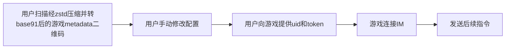

# 役次元 Tencent IM 控制协议（草稿，正在实现）

## 规范前言

由于设备类型丰富，协议采用 **事件 ID 驱动的通用控制结构**。
每个事件以唯一的 `id` 标识，并根据设备类型关联特定的**默认参数模板**。用户可对模板参数自定义并设置安全阈值。



**如何发送指令**

除游戏metadata二维码外，每一段指令都需要**JSON 对象序列化成字符串**后填入腾讯 IM 消息包中`payload.text`

建议先查看役次元IM基础协议 [IM_basic.md](IM_basic.md) 

遇到问题请先查看 [troubleshooting.md](troubleshooting.md) 

------

## 一、游戏 Metadata

```jsonc
{
  "code": "game_metadata",
  "id": "com.github.username.minecraft", // 游戏唯一识别码
  "name": "Minecraft", // 显示名称
  "startup": "https://your-domain.com/game",
  "homepage": "https://gitee.com/xxx/xxx",
  "author": "作者名称",
  "icon": "https://xxx.com/xxx.avif",
  "cmd": [ //声明会用到的指令
    {
      "id": "hurt",
      "name": "受到攻击",
      "device": "mustobator",
      "default_settings": {/*默认执行命令，用户可以手动修改，参考下方说明*/}
    }
  ]
}
```

------

## 1）字段规范说明

| 字段名                   | 类型   | 必填 | 说明                                                         |
| ------------------------ | ------ | ---- | ------------------------------------------------------------ |
| code                     | string | ✅    | "game_metadata"写死                                          |
| `id`                     | string | ✅    | 游戏唯一识别码。建议填写可验证的信息，后续可能涉及创作激励计划，例如`com.qq.123456789.minecraft`；`com.github.username.minecraft` |
| name                     | string | ✅    | app端展示的游戏名称                                          |
| startup                  | string | ❌    | 设置后点击”开始游戏“自动打开网页并通过get参数传递`uid`和`token` |
| homepage                 | string | ✅    | app主页。在役次元app点击“查看教程”所跳转到的页面             |
| author                   | string | ✅    | 作者名                                                       |
| icon                     | string | ❌    | 游戏图标，建议 200px 方形图片，支持avif。缺省使用默认 logo 代替。 |
| `cmd`                    | array  | ✅    | 指令列表，每个元素为一个可触发的事件定义                     |
| `cmd[].name`             | string | ✅    | 指令展示名称                                                 |
| `cmd[].id`               | string | ✅    | 指令唯一标识符，遵循变量命名规则（字母开头），不能以 `_` 开头（保留指令） |
| `cmd[].device`           | string | ✅    | 指令控制的设备类型（见下方设备定义）                         |
| `cmd[].default_settings` | object | ✅    | 设备特定的参数模板                                           |

------

## 2）各设备类型默认参数与指令定义

### 1️⃣ 情趣电击（estim）

| 参数名              | 类型    | 说明                                                     |
| ------------------- | ------- | -------------------------------------------------------- |
| `intensity`         | number  | 电流强度；范围：`[0,180]`                                |
| channel             | string  | 指令控制的通道。`"A" | "B" | "AB"`                       |
| `waveform`          | string  | 频率名称或id                                             |
| `incremental`       | number  | 每次触发增加多少强度。默认为 0，可省略。                 |
| `duration`          | number  | 单次放电时长（毫秒），`-1`代表自动重复执行               |
| `stop`              | boolean | 是否立即停止放电（与其余配置冲突）                       |
| `reset_incremental` | boolean | 清除已累计递增的电击强度，回到初始强度（与其余配置冲突） |

------

### 2️⃣ 榨精机（stroker）

| 参数名     | 类型   | 说明                                   |
| ---------- | ------ | -------------------------------------- |
| `waveform` | string | 频率名称或id                           |
| `duration` | number | 执行时长（毫秒）；`-1`代表自动重复执行 |
| stop       | bool   | 立即停止执行（与其他参数冲突）         |

------

### 3️⃣ 智能灌肠机（enema）

| 参数名     | 类型   | 必填 | 说明                                                         |
| ---------- | ------ | ---- | ------------------------------------------------------------ |
| cmd        | 命令   | ✅    | `fill`（灌肠）`expand`（膨胀）`shrink`（缩小）`pause`（暂停运行） |
| `duration` | number | ❌    | 执行时长（毫秒），`cmd`为`pause`时不填此参数                 |

------

### 4️⃣ 跳蛋（vibrator）

| 参数名     | 类型   | 说明                                   |
| ---------- | ------ | -------------------------------------- |
| `waveform` | string | 频率名称或id                           |
| `duration` | number | 执行时长（毫秒）；`-1`代表自动重复执行 |
| stop       | bool   | 立即停止（与其他参数冲突）             |

## 二、发送metadata后发送执行指令

```
{
  "code": "game_cmd",
  "id": "hurt"
}
```

## 三、更新游戏事件定义

将游戏metadata装入IM的`payload.text`中发送

## 四、自定义指令（草稿，预留接口，暂缓开发）

1️⃣自定义波形与强度

```
{
  "code": "game_cmd",
  "id": "_estim_custom_waveform",
  "payload": {
  
  }
}
```


