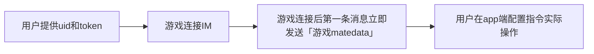

# 役次元 Tencent IM 控制协议（草稿，未实现）

## 规范前言

由于设备类型繁多，协议采用 **事件 ID 驱动的通用控制结构**。
 每个事件以唯一的 `id` 标识，并根据 `device` 类型关联特定的**默认参数模板**与**指令定义**。



**如何发送指令**

下方每一段指令都需要**JSON 对象序列化成字符串**后填入腾讯 IM 消息包中`payload.text`

建议先查看役次元IM基础协议 [IM_basic.md](IM_basic.md) 

------

## 一、step1：游戏 Metadata 示例

```jsonc
{
  "code": "game_metadata",
  "id": "com.github.username.minecraft", // 游戏唯一识别码
  “name": "Minecraft", // 显示名称
  "cmd": [ //声明会用到的指令
    {
      "id": "hurt",
      "name": "受到攻击"
      "device": "mustobator",
      "default_settings": {/*默认执行命令，用户可以手动修改，参考下方说明*/}
    }
  ]
}
```

------

## 二、字段规范说明

| 字段名                   | 类型   | 必填 | 说明                                                         |
| ------------------------ | ------ | ---- | ------------------------------------------------------------ |
| code                     | string | ✅    | "game_metadata"写死                                          |
| `id`                     | string | ✅    | 游戏唯一识别码。建议填写可验证的信息，后续可能涉及创作激励计划，例如`com.qq.123456789.minecraft`；`com.github.username.minecraft` |
| name                     | string | ✅    | app端展示的游戏名称                                          |
| `cmd`                    | array  | ✅    | 指令列表，每个元素为一个可触发的事件定义                     |
| `cmd[].name`             | string | ✅    | 指令展示名称                                                 |
| `cmd[].id`               | string | ✅    | 指令唯一标识符，遵循变量命名规则（字母开头），不能以 `_` 开头（保留指令） |
| `cmd[].device`           | string | ✅    | 设备类型（见下方设备定义）                                   |
| `cmd[].default_settings` | object | ✅    | 设备特定的参数模板                                           |

------

## 三、各设备类型默认参数与指令定义

### 1️⃣ 情趣电击（estim）

| 参数名              | 类型    | 说明                                                     |
| ------------------- | ------- | -------------------------------------------------------- |
| `intensity`         | number  | 电流强度（0–100）                                        |
| `waveform`          | string  | 频率名称或id                                             |
| `incremental`       | boolean | 是否逐步增强强度                                         |
| `duration`          | number  | 单次放电时长（毫秒）                                     |
| `stop`              | boolean | 是否立即停止放电（与其余配置冲突）                       |
| `reset_incremental` | boolean | 清除已累计递增的电击强度，回到初始强度（与其余配置冲突） |

------

### 2️⃣ 榨精机（mustobator）

| 参数名     | 类型   | 说明                           |
| ---------- | ------ | ------------------------------ |
| `waveform` | string | 频率名称或id                   |
| `duration` | number | 执行时长（毫秒）               |
| stop       | bool   | 立即停止执行（与其他参数冲突） |

------

### 3️⃣ 灌肠机（enema）

| 参数名     | 类型   | 说明                                                         |
| ---------- | ------ | ------------------------------------------------------------ |
| cmd        | 命令   | `fill`（灌肠）`expand`（膨胀）`shrink`（缩小）`pause`（暂停运行） |
| `duration` | number | 执行时长（毫秒）                                             |

------

### 4️⃣ 跳蛋（vibrator）

| 参数名     | 类型   | 说明                       |
| ---------- | ------ | -------------------------- |
| `waveform` | string | 频率名称或id               |
| `duration` | number | 执行时长（毫秒）           |
| stop       | bool   | 立即停止（与其他参数冲突） |

## 四、后续发送执行指令

```
{
  "code": "game_cmd",
  "id": ”hurt“
}
```


# 役次元 Tencent IM 控制协议（备选草稿，未实现）

## 规范前言

- 下方每一段代码块就是腾讯 IM 包中 **`payload.text` 的完整内容**（JSON 对象序列化成字符串前的结构）

------

## 1) 通道控制（`control_channel`）

**用途**：
 将指定通道的输出参数直接设为

> ```
> app端设置的最大强度 × ( strength / 100 )
> ```

并维持指定的毫秒数（`duration_ms`）后自动结束，或由下一条指令覆盖。

**约束**：

- `channel ∈ {"A","B","AB"}`
- `strength ∈ [0,100]` 且为整数
- `duration_ms` 为正整数，单位毫秒（ms）；为 0 时表示持续至下一条指令（持续执行）。建议范围 `1000 – 60000`

```json
{
  "code": "game_opts",
  "actions": [
    {
      "type": "estim",
      "action": "control_channel",
      "data": {
        "channel": "A",
        "strength": 60,
        "duration_ms": 5000
      }
    },
    {
      "type": "estim",
      "action": "control_channel",
      "data": {
        "channel": "B",
        "strength": 30,
        "duration_ms": 4000
      }
    }
  ]
}
```

**说明：**

- `strength` ：当前相对强度百分比（例如 60 表示 60 %）。
- `duration_ms` ：执行持续时间（单位 ms）。
- 通道 `"AB"` 表示同时作用于 A 与 B 两个通道。
- 后续版本可在 `data` 中新增 `waveform`、`frequency_hz` 等字段，向后兼容。

------

## 2) 清空通道（`clear_channel`）

**用途**：
 清空指定通道的排队任务或缓冲，不影响当前已生效的固定强度值。

**约束**：`channel ∈ {"A","B","AB"}`

```json
{
  "code": "game_opts",
  "type": "estim",
  "action": "clear_channel",
  "data": {
    "channel": "B"
  }
}
```

------

## 3) 设备配对结果（`device_paired`）

**用途**：
 首次握手或扫码配对完成后，**由 App 端发送给 服务端**，用于同步配对状态。

**约束**：`status ∈ {"success","failed"}`

```json
{
  "code": "game_opts",
  "type": "device_paired",
  "action": "device_paired",
  "data": {
    "status": "success",
    "uid": "<user-uid>"
  }
}
```

------

## 5) 错误回执（`error`） 

**用途**：
 app向上游或调试端明确失败原因与可恢复性，便于闭环排查。

**约束**：

- `severity ∈ {"error","warning"}`
- `code` 为整型错误码
- `details` 可选 dict类型

```json
{
  "code": "game_opts",
  "type": "estim",
  "action": "error",
  "data": {
    "code": 403,
    "message": "invalid channel value",
    "severity": "error",
  }
}
```

